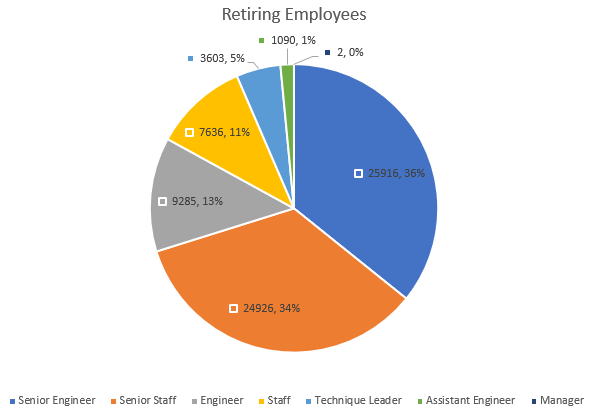

# Pewlet Hackard Analysis
In this module, we have been working with SQL in PostgreSQL. Within the pgAdmin tool, we have created databases, tables, and queries to analyze a ficticious company's HR database.

## Overview
For this module's challenge, we have been tasked with three things:
1. Identify the number of retiring employees by title as part of deliverable 1.
2. Identify employees eligible to participate in a mentorship program as part of deliverable 2.
3. Provide analysis for management in preparation for the "silver tsunami" of employees reaching retirement age.

## Results
Our SQL queries for deliverable 1 and 2 can be found in the [Challenge SQL](Queries/Employee_Database_challenge.sql) file.

We generated four CSV files with the two deliverables:
1. [Retirement Titles](Data/retirement_titles.csv) is a list of employees born between the years 1952 and 1955 and their titles throughout their careers.
2. [Unique Titles](Data/unique_titles.csv) is a list of current employees born between the years 1952 and 1955 and their latest title.
3. [Retiring Titles](Data/retiring_titles.csv) is a list of unique retiring titles along with the count of retiring employees for each.
4. [Mentorship Eligibilty](Data/mentorship_eligibilty.csv) is a list of current employees born in the year 1965, or employees eligible for mentorship.

Four takeaways from the delivarables:
* The number one takeaway to consider is the large number of retiring employees. There are a total of 72,458 employees that are retirement eligible.
* Of the retiring employees, about 36% are "Senior Engineers".
* About 34% of the retiring employees are "Senior Staff".
* There were only 1,549 employees identified as being eligible for mentorship based on the birth year of 1965.

The number of retiring employees with senior titles is especially worrisome.
* 

## Summary
As mentioned in the results, the number of retiring employees is quite staggering. 72,458 roles will need to be filled as the "silver tsunami" impacts. 

Provide high-level responses to the following questions, then provide two additional queries or tables that may provide more insight into the upcoming "silver tsunami."
How many roles will need to be filled as the "silver tsunami" begins to make an impact?
Are there enough qualified, retirement-ready employees in the departments to mentor the next generation of Pewlett Hackard employees?
