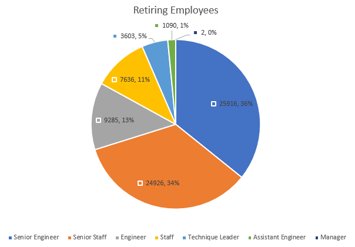

# Pewlet Hackard Analysis
In this module, we have been working with SQL in PostgreSQL. Within the pgAdmin tool, we have created databases, tables, and queries to analyze a fictitious company's HR database.

## Overview
For this module's challenge, we have been tasked with three things:
1. Identify the number of retiring employees by title as part of deliverable 1.
2. Identify employees eligible to participate in a mentorship program as part of deliverable 2.
3. Provide analysis for management in preparation for the "silver tsunami" of employees reaching retirement age.

## Results
Our SQL queries for deliverable 1 and 2 can be found in the [Challenge SQL](Queries/Employee_Database_challenge.sql) file.

We generated four CSV files with the two deliverables:
1. [Retirement Titles](Data/retirement_titles.csv) is a list of employees born between the years 1952 and 1955 and their titles throughout their careers.
2. [Unique Titles](Data/unique_titles.csv) is a list of current employees born between the years 1952 and 1955 and their latest title.
3. [Retiring Titles](Data/retiring_titles.csv) is a list of unique retiring titles along with the count of retiring employees for each.
4. [Mentorship Eligibilty](Data/mentorship_eligibilty.csv) is a list of current employees born in the year 1965, or employees eligible for mentorship.

Four takeaways from the deliverables:
* The number one takeaway to consider is the large number of retiring employees. There are a total of 72,458 employees that are retirement eligible.
* Of the retiring employees, about 36% are "Senior Engineers".
* About 34% of the retiring employees are "Senior Staff".
* There were only 1,549 employees identified as being eligible for mentorship based on the birth year of 1965.

The number of retiring employees with senior titles is especially worrisome.
* 

## Summary
As mentioned in the results, the number of retiring employees is quite staggering. Over 74K roles will need to be filled as the "silver tsunami" impacts.

We were instructed to only consider employees born in the year 1965 as being eligible for mentorship. Unfortunately, that only give us about 1.5K employees. One way to improve on this number is to consider employees born in other years. For example, we are able to expand the number to over 75K employees once we adjust the birth date condition to include four years. This would allow the company to survive the near-term retirement problem.
```
e.birth_date BETWEEN '1965-01-01' AND '1965-12-31'
```

One of the other interesting things that stood out after analyzing the employees birth dates are the number of employees that are born after the year 1965. That number was identified as 0 with the below query. Pewlet Hackard needs to hire some younger employees to set themselves up well for the future.
```
SELECT COUNT(DISTINCT e.emp_no)
FROM employees e
JOIN titles t
ON e.emp_no = t.emp_no
WHERE e.birth_date >= '1966-01-01'
AND t.to_date = '9999-01-01';
```

The next set of retirements will really hurt them also if we look at the number of employees born between 1956 and 1960. The query below yields about another 74K employees.
```
SELECT COUNT(DISTINCT e.emp_no)
FROM employees e
JOIN titles t
ON e.emp_no = t.emp_no
WHERE e.birth_date >= '1956-01-01'
AND e.birth_date < '1960-01-01'
AND t.to_date = '9999-01-01';
```

In summary, Pewlet Hackard has enough experienced employees to train the new generation, but the retirement problem is not going away soon, and they'll need to adjust the demographics of the workforce quickly.
